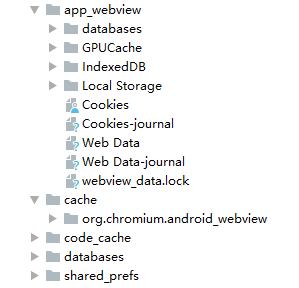

# WebView

## 1.主要方法:

| 类名 |  作用 |
|---|---|
| WebSettings |  配置
| WebViewClient | 请求控制，webview回调通知
| WebChromeClient | 辅助：js，title，进度，权限

## 2.load
+ loadUrl 支持http file content scheme
+ loadData 加载一段html 不常用
```java
    // 存在中文乱码问题
    loadData(html, "text/html", "utf-8") 
    // 调整为
    loadData(html, "text/html; charset=UTF-8", null)
```
+ loadDataWithBaseURL 使用cache部分，8.0以上有坑，会导致goBack失效。

## 3.状态控制
+ onResume 单独webview使用
+ onPause
+ resumeTimers 全局webview使用
+ pauseTimers

## 4.前进后退
+ canGoBack()  goBack()
+ canGoForward() goForward()
+ goBackOrForward(step) step 负数：goBack，正数：goForward。 数字表示步数

## 5.WebSettings
+ setJavaScriptEnabled
+ setUseWideViewPort 将图片调整到适合webview的大小 
+ setLoadWithOverviewMode 缩放至屏幕的大小
+ setLoadsImagesAutomatically 自动加载图片

## 4.缓存 android4.4 chrome
+ webview cache
+ Dom Storage
+ IndexedDB
+ Application Cache
+ WebView Database
+ File System



### 4.1 webview http协议头
+ Cache-Control(有效时长) 或 Expires(失效时间)

    >+ Expires是 HTTP1.0 标准中的字段，Cache-Control 是 HTTP1.1 标准中新加的字段
    >+ 当这两个字段同时出现时，Cache-Control 优先级较高
    
+ Last-Modified(标记服务器最新更新时间) 或 Etag(标记服务器最新更新时间)
    >+ Last-Modified下次请求时，如果文件缓存过期，浏览器通过 If-Modified-Since 字段带上这个时间，发送给服务器，由服务器比较时间戳来判断文件是否有修改。如果没有修改，服务器返回304告诉浏览器继续使用缓存；如果有修改，则返回200，同时返回最新的文件。
    >+ Etag 的取值是一个对文件进行标识的特征字串，浏览器通过If-None-Match 字段把特征字串发送给服务器，由服务器和文件最新特征字串进行匹配，来判断文件是否有更新：没有更新回包304，有更新回包200。
    >+ Etag 和 Last-Modified 可根据需求使用一个或两个同时使用。两个同时使用时，只要满足基中一个条件，就认为文件没有更新。
+ setCacheMode 设置webview cacheMode 4种mode
+ chrome cache 自动创建 /data/data/包名/cache/org.chromium.android_webview/

### 4.2 Dom Storage 
+ setDomStorageEnabled(true); // 开启
+ 大小5M
+ 分为sessionStorage 和 localStorage

### 4.3 Indexed DB
+ setJavaScriptEnabled(true); // 开启
+ 大数据存储 默认250MB
+ noSQL方式

### 4.4 Application Cache 不推荐
+ setAppCacheEnabled(true)
+ 配置manifest 方式： 

```html
<html manifest="xxx.appcache">
xxx.appcache：

    CACHE MANIFEST
    # 2017-05-13 v1.0.0
    /bridge.js
    NETWORK:
    http://www.huajiao.com//s5.ssl.qhres.com/!407aced0/tab.js
    FALLBACK:
    /404.html
```

### 4.5 WebSQL Database 不推荐，已经不再维护
+ setDatabaseEnabled(true); // 开启数据库
### 4.5 File System H5新加入的缓存机制，WebView暂不支持

## 5.JS交互
+ 1.android调用JS方式：
    + evaluateJavascript 4.4以上，推荐使用
    + loadUrl

+ 2.JS调用android方式：
    + WebChromeClient中onJsAlert，onJsConfirm，onJsPrompt回调方式
    + addJavascriptInterface 对象映射方式，4.2以下版本存在安全漏洞
    + shouldOverrideUrlLoading 回调，使用scheme方式拦截处理

## javascriptinterface 常见漏洞
+ searchBoxJavaBridge_ 通过JS获取android系统级runtime。从而可以反射获取用户隐私，修复方式：removeJavascriptInterface("searchBoxJavaBridge_")
+ accessibility，accessibilityTraversal 窃取浏览器cache，修复方式：removeJavascriptInterface 和 setSavePassword(false) 


> 目前已知的 WebView 漏洞有 4 个,分别是：
> + 1、[CVE-2012-6636](https://cve.mitre.org/cgi-bin/cvename.cgi?>name=CVE-2012-6636)，揭露了 WebView 中 addJavascriptInterface 接口会引起远程代码执行漏洞；
> + 2、[CVE-2013-4710](https://cve.mitre.org/cgi-bin/cvename.cgi?name=CVE-2013-4710)，针对某些特定机型会存在 addJavascriptInterface API 引起的远程代码执行漏洞；
> + 3、[CVE-2014-1939](https://cve.mitre.org/cgi-bin/cvename.cgi?name=CVE-2014-1939) 爆出 WebView 中内置导出的 “searchBoxJavaBridge_” Java Object 可能被利用，实现远程任意代码；
> + 4、[CVE-2014-7224](https://cve.mitre.org/cgi-bin/cvename.cgi?name=CVE-2014-7224)，类似于 CVE-2014-1939 ，WebView 内置导出 “accessibility” 和 “accessibilityTraversal” 两个 Java Object 接口，可被利用实现远程任意代码执行。


### 6.坑
WebView(Context context, AttributeSet attrs, int defStyleAttr) defStyleAttr不能传入0，否则会导致软键盘无法弹出

webview.addJavascriptInterface 小米6 系统8.0,OPPO K1 系统8.1。只是第一个add进入的会生效。

webview.loadDataWithBaseURL 使用cache部分，8.0以上有坑，会导致goBack失效。

透明webview在oppo vivo 8.0系统白屏问题：http和https切换的时候，http或者https内部切换的时候没问题 

webview onDraw中。如果canvas.drawPath 切割图形的时候，即便是设置是0，也会存在1个像素的透明空白。并且会透传整个xml

webview 初始化使用application，会导致<input type="month"/>弹不出系统选择日期dialog